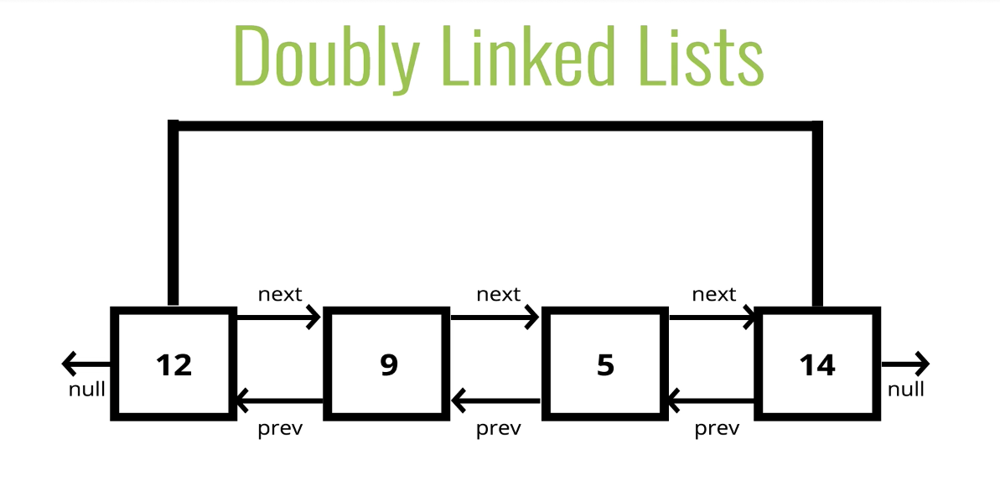

# 📝 Intro to Doubly Linked Lists

## Objectives

- Construct a Doubly Linked List 
- Compare and contrast Doubly and Singly Linked Lists
- Implement basic operations on a Doubly Linked List.

### <u>What is a Doubly Linked List?</u>
<b>Almost</b> Identical to Singly Linked Lists, except every node has <b>another</b> poitner, to the <b>previous</b> node! A pointer from each node fore and aft is how DLL gets its name.
  
The usage of prev pointers makes it possible to move/iterate backwards at the expense of two-times memory usage requirement as now each vertex records one additional pointer. The positive side effect of this ability to move backwards is now we can address the weak removal at tail case of the Singly Linked List.

Here is a working example of how DLL works by [VisuAlgo](https://visualgo.net/en/list)

## Comparison with Singly Linked Lists
<u><b>Doubly Linked Lists</b></u>
- Able to start iterating from the tail to the head of the list using 'list.prev' like 'list.next' on SLL
- Requires more memory becasue of the connections in two directions

<u><b>Singly Linked Lists</b></u>
- Can only move from nodes in one direction
- Uses less memory than DLL

-- Benefits of DLL -- 

#Big O of DLL

- <b>Insertion</b> - 
- <b>Removal</b> - 
- <b>Searching</b> - 
- <b>Access</b> -

